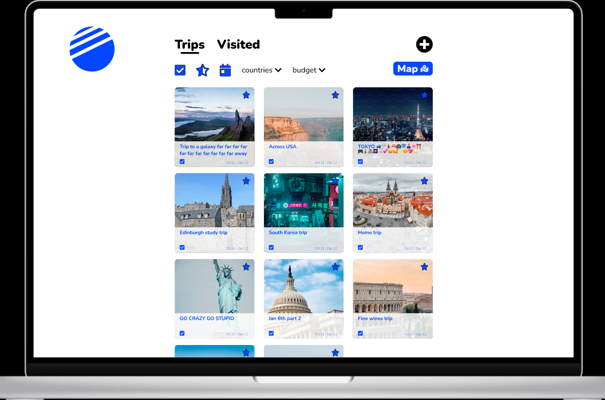
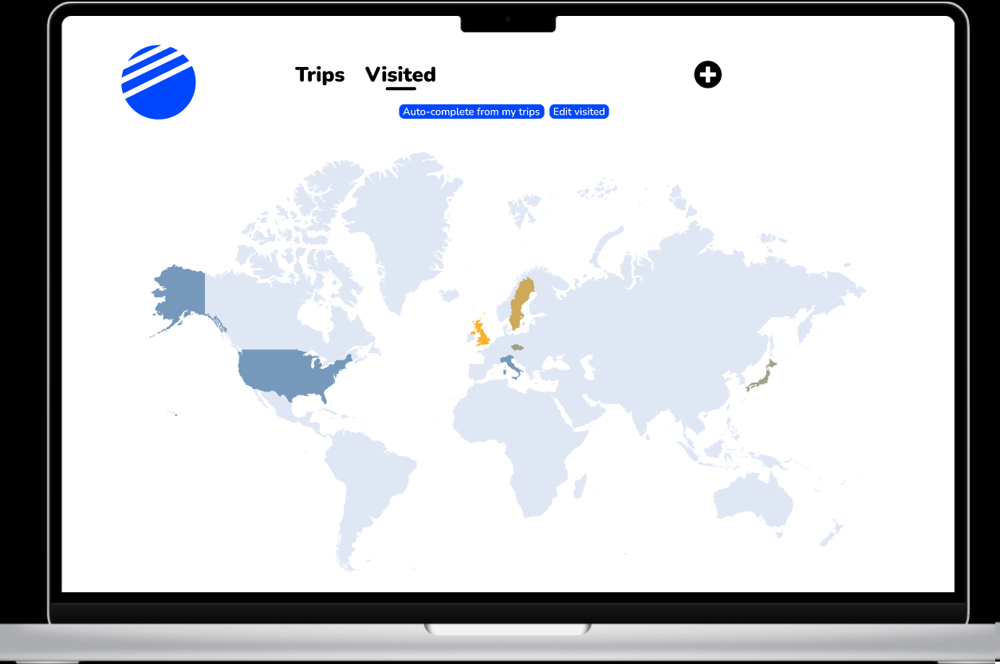
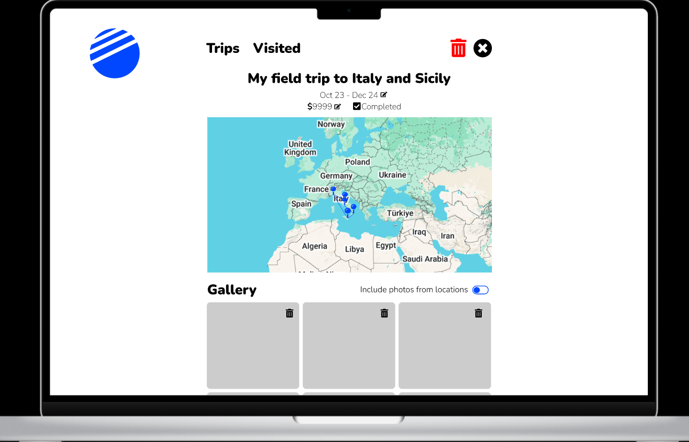

# Cestovatelský deník

- autoři: **Dominik Borek** (xborek12), Ondřej Hruboš (xhrubo01), Radek Jestřabík (xjestr04)

## Uživatelský průzkum
Uživatelský průzkum probíhal formou rozhovorů s potencionálními uživateli aplikace.
### Potřeby a požadavky
1. *Student střední školy (věk 18)*
	- chce si zaznamenávat, která místa bude chtít navštívit v budoucnu
	- plánování cesty o prázdninách
	- kalkulačka výdajů pro jednotlivé účastníky cesty
	- aplikace bude zdarma
2. *Studentka vysoké školy (věk 20)*
	- chce si zaznamenat místa, která navštívila a která chce navštívit
	- ukládání fotek z jednotlivých cest
	- zaznamenávání výletů v rámci cesty do zahraničí
	- poznámky o cestě (co se líbilo, nelíbilo atd.)
3. *Pracující člověk (věk 28)*
	- chce mít fotky z výletů pohromadě a na jednom místě
	- mapu výletů, které absolvoval
	- sdílet plán se známými

### Specifikace
- uživatelé chtějí zaznamenávat absolvované i plánované cesty
- uživatelé chtějí mít ponětí o ceně cesty
- uživatelé chtějí vidět cesty vizualizované na mapě
- uživatelé si chtějí ukládat fotky ze svých cest a spojovat je s konkrétními cestami
- uživatelé chtějí ukládat podrobné informace o cestě - klady, zápory, poznámky k výletu

## Průzkum existujících řešení

- Dominik Borek: Visited, Scout
- Ondřej Hruboš: Wanderlog, Sygic
- Radek Jestřabík: Tripsy, TripIt

#### Wanderlog
- **Výhody**
	- mapa navštívených míst
	- sdílení cesty s ostatními (možnost kolaborace)
	- velmi přehledné GUI při plánování cesty (itinerář a mapa na jednom místě, lehce se s ním pracuje)
	- možnost přidávat jednotlivé výdaje do seznamu
	- synchronizace s Google mapami
	- rozhraní pro iOS, Android i Web
- **Nevýhody**
	- potřeba registrace
	- hodně nepotřebných funkcí, které zahlcují GUI (snadno se v aplikaci ztratím)
	- lze přidat pouze jednu fotku k cestě

#### Sygic
- **Výhody**
	- mapa s významnými místy po celém světě
	- předpověď počasí pro vybraný termín naplánované cesty
	- aplikace může fungovat offline po stáhnutí balíčků k jednotlivým místům
	- synchroznizace s kalendářem
	- jde používat i bez registrace
- **Nevýhody**
	- velmi pomalé načítání obrázků
	- GUI je ve verzi zdarma značně nepřehledné kvůli reklamám
	- možnost přidávat výlety v rámci jednotlivých cest pouze v jeden den (nelze přidat výlet, který trval dva a více dnů)
	- aplikace pouze pro iOS nebo Android

#### Tripsy  
- **Výhody**
	-   K cestám je možné si přidávat různé dokumenty
	-   Je možné přidávat další účastníky, kteří se účastní cesty
	-   Možnost ukládat si přímo letenky, které mohou být
	-   Není nutné si zakládat účet
- **Nevýhody**
	-   Nepřehledné vybírání nové aktivity (výletu), výběr z příliš mnoha kategorií
	-   Není celkové zobrazení všech cest dohromady
	-   Není možné si přidávat fotky / dokumenty k jednotlivým aktivitám bez placené verze
	-   Funguje pouze jako aplikace na iOS

#### TripIt  
- **Výhody**
	-   Je možné si přidat fotky k jednotlivým aktivitám
	-   Jednodušší uživatelské rozhranní, ve kterém se lépe orientuje
	-   Časová osa jednotlivých aktivit
- **Nevýhody**
	-   Je nutné si založit účet
	-   Požadují od uživatelů osobní údaje - jméno, datum narození, město
	-   Není možné si zaznamenávat informace o ceně

#### Visited
- **Výhody**
    - jednoduché zaznamenávání navštívených cest a kam se chce uživatel podívat. Zahrnuje i jednotlivá města
    - žebříček umístění se s porovnáním s ostatními uživateli v navštívenosti jednotlivých zemí a možnost zahrnutí cíle
    - vytisknutí si plakátu, na kterém bude zobrazená stejná mapa, jako v aplikaci zahrnující byl jsem, chci být a žiji
    - grafické zobrazení, jaký typ cestovatele je uživatel
    - vytvoření si cestovních plánů
    - inspirace, co navštívit, seznamy ostatních uživatelů a zaznamenání zážitků
    - zobrazení preference hotelů

- **Nevýhody**
    - placené pro vytvoření si cestovního plánu, nebo zobrazení si seznamu uživatelů pro jednotlivé země, či zahrnutí do mapy pro jednotlivé země
    - Po otevření si Inspirace aplikace vždy nabízí ty stejné "výlety", kam se podívat. A nikam se to neukládá
    - poměrně složité ovládání, neaktualizují se automaticky grafy, pro člověka matoucí propojení jednotlivých grafů se seznami. Například graf, který se zobrazí na první stránce je spojený se seznamy, na které se musí proklikat až na mapu, na které si uživatel zaklikne kde byl, nebo kam chce
    - nepřívětivé UI pro uživatele, velmi matoucí
    - pouze pro mobilní telefon

#### Scout
- **Výhody**
    - přívětivé UI pro uživatele, vše je logicky oddělené a jednoduché pro ovládání
    - možnost zobrazení si cest ostatních uživatelů, včetně míst, kde jedli a kde bydlely na jednom místě
    - možnost zahrnout jednotlivé atrakce do kalendáře, včetně jídla a hotelů
    - možnost sdílet výlet s přáteli nebo ho zveřejnit na webu pro ostatní uživatele

- **Nevýhody**
    - pokud si uživatel nezaplatí pro verzi, má omezený počet míst, nemůže vidět obrázky z míst, přátelé nemohou vytvářet jednotlivé trips
    - při vytvoření nového tripu není možné si kliknout na mapu na místo, ale je třeba dát adresu.
    - Pouze jako webová aplikace.

### Inspirace
- inspirace mapou z aplikace Wanderlog pro mapu cest
- inspirace mapou z aplikace Visited pro mapu navštívených zemí
- inspirace přidávání fotek k jednotlivým výletům (inspirace aplikací TripIt)

## Zadání

- Aplikace slouží k zaznamenávání cest uživatele. Uživatel může prostřednictvím formuláře přidávat jednotlivé cesty, které obsahují informace o místě, datu a poznámkách z cesty.
- Hlavní funkce:
	- zobrazení seznamu cest
		- cesty jako dlaždicový seznam
		- možnost odstranení cesty
		- editace cesty
	- zobrazení detailu cesty
		- zobrazí popisek a mapu
		- editace cesty
		- galerie cesty (přidávání a odstraňování fotek)
	- přidání nové cesty
		- výběr lokace na mapě
		- nastavení popisku, data, ...
		- přidání více lokací pro vytvoření cesty
	- zobrazení všech cest na mapě
		- kliknutí na cestu pro zobrazení detailů
	- zobrazení navštívených zemí
	    - interaktivní mapa pro výběr a odstranění navštívených zemí a zemí, které chce uživatel navštívit
    - galerie všech fotek ze všech cest

## Návrh GUI

Návrhy jsou vypracovány ve Figmě. Každý člen týmu zpracoval vlastní návrh. Jako základ se poté vybral návrh ITU-Svelte (autor Ondřej Hruboš) a jednotlivé prvky od dvou zbylých návrhů.

- Dominik Borek (xborek12): https://www.figma.com/design/3DWzGsN5vkDDYcwEG7eQvr/ITU-react?node-id=0-1&m=dev&t=dRPIcPkop96g0Gvn-1
- Ondřej Hruboš (xhrubo01): https://www.figma.com/design/vt8EMDxl3a2l9MzzgXdq8e/ITU-svelte?node-id=0-1&m=dev&t=abqXFR4lVOJOmJ3i-1
- Radek Jestřabík (xjestr04): https://www.figma.com/design/rfnYUxYanqTjzAzjGPy4Zb/ITU-Vue?node-id=9-459&m=dev&t=xzsNG39NqbpFlrzy-1

### Screenshoty klíčových částí

### Výběr technologií

Každý člen týmu vypracuje vlastní implementaci pomocí jiné technologie.

- Dominik Borek (xborek12): **React**, *Material UI*
- Ondřej Hruboš (xhrubo01): **Svelte**, *BeerCSS*
- Radek Jestřabík (xjestr04): **Vue**, *Tailwind*

### Návrh API

Api bylo implementováno v jazyce Python pomocí frameworku Flask.
Api má následující strukturu:
- `Vylet`
	- `nazev`
	- `od datum`
	- `do datum`
	- `chci navstivit / uz jsem navstivil`
	- `List<{`
		- `nazev`
		- `Tuple<float,flaot> GPS`
		- `Bool oblibene`
		- `List<Photo>`
		- `komentar`
	}> `Podvylety`
	- `List<Photo> samostatne fotky`
	- `budget`
	- `List<str> plusy`
	- `List<str> minusy`
	- `poznamky`
- `NavstivenaZeme`
	- `chci navstivit/navstivil jsem`
	- `kod zeme`
	- `nazev zeme`
- Api endpoints:
	- `/trips`
	- `/trip/[id]`
	- `/visited`
	- `/visited/add`
	- `/visited/delete/[code]`
	- `/visited/update/[code]`
	- `/trip/add`
	- `/trip/update`
	- `/trip/delete/[id]`

